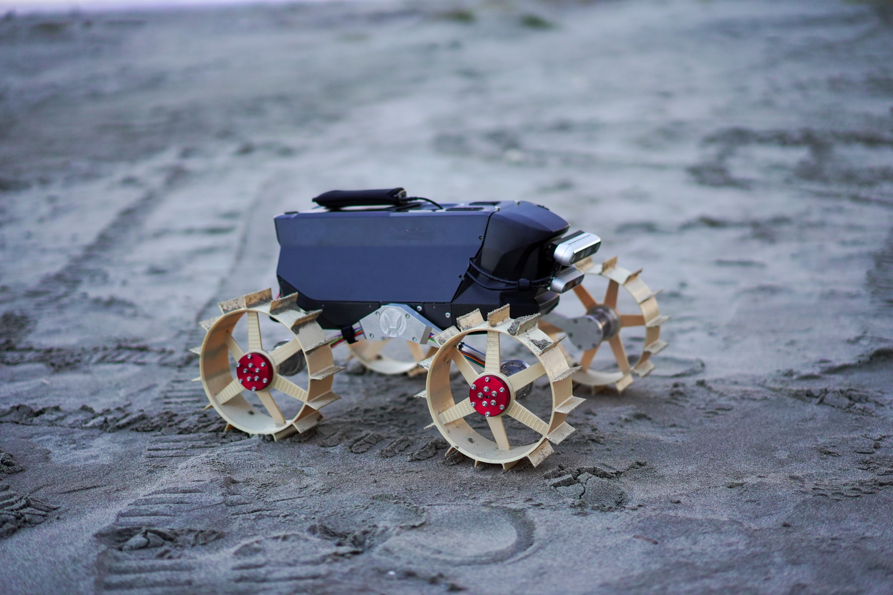

# Moonraker Rover software stack

</img>

Moonraker project with ROS2 Humble \
maintainer: Junnosuke Kamohara

## Git maintenance rule
- Always put the stable code in `main` branch
- If you want to add any features, create `feature` branch and merge it to `main` later
- Send pull request before merge to main branch (I added branch rule, so you cannot directly merge with main branch.)
- Only upload source code and configuration files (no heavy data!)

## Environment
The repository depends on
- Robot computer: NUC13 (Ubuntu 22.04, ROS2 Humble)
- Micro controller: ESP32 (micro-ros-arduino for Humble)
- Host PC (Either ROS2 foxy or humble to communicate with robot computer)

## Setup package
In this project, we use docker for easy deployment.  
You need internet in this setup.

First, clone this repository under your home directory. 
```bash
git clone git@github.com:Space-Robotics-Laboratory/rover_moonraker.git
```

### Build docker images
Then, build docker images


(perception image)
```bash
cd rover_moonraker
./docker/build_image.sh perception
```

(navigation image)
```bash
cd rover_moonraker
./docker/build_image.sh navigation
```

(micro-ros image)
```bash
docker pull microros/micro-ros-agent:humble
```

### Build ros packages
(perception)
```bash
cd rover_moonraker
./docker/run_container.sh perception
```
Then, inside container shell
```bash
colcon build --symlink-install
```

(navigation)
```bash
cd rover_moonraker
./docker/run_container.sh navigation
```
Then, inside container shell
```bash
colcon build --symlink-install
```


## Run

(micro-ros)
```bash
./docker/run_container.sh micro-ros
```

(perception)
```bash
./docker/run_container.sh perception
```
Then, inside container shell, run
```bash
/docker/foxy_startup.sh
```

(navigation)
```bash
./docker/run_container.sh navigation
```
Then, inside container shell, run
```bash
/docker/humble_startup.sh
```

## System diagram
Documentation WIP

## Usage
Documentation WIP