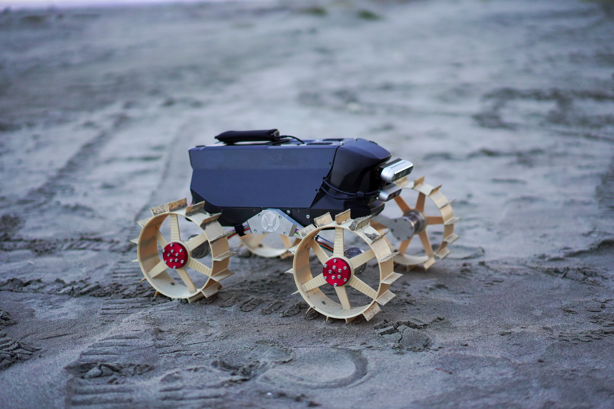

# Moonraker Rover software stack

</img>

Moonraker project with ROS2 Humble
- maintainer: Junnosuke Kamohara

## Git maintenance rule
- Always put the stable code in `main` branch
- If you want to add any features, create `feature` branch and merge it to `main` later
- If you fixed the bug and want to update, make `devel/bug` branch and merge it with `main` branch
- Send pull request before merge to main branch (I added branch rule, so you cannot directly merge with main branch.)
- Only upload source code and configuration files (no heavy data!)

## Environment
The repository mainly depend on
- Robot computer: NUC13 (Ubuntu 22.04, ROS2 Humble)
- Host PC: ThinkPad (Ubuntu 20.04, ROS2 Foxy)
- Micro controller: ESP32 (micro-ros-arduino for Humble)

## Setup package
Clone this repoo
```bash
mkdir -p ros2_ws/src
cd ros2_ws/src
git clone --recursive git@github.com:Space-Robotics-Laboratory/rover_moonraker.git
rosdep install --from-paths src -i
colcon build --symlink-install
```

## Sorce your workspace
Before you run, make sure you source the workspace where you built this package.
```bash
cd ros2_ws
source install/setup.bash
```

## System diagram (WIP)